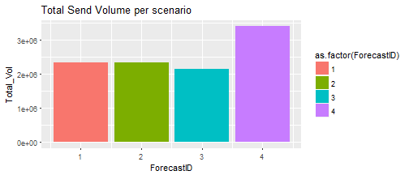

## Sample Code


```r
library(readxl)
library(tidyverse)

DT1 <- read_excel("InitCampDB.xlsx", sheet=1)
DT2 <- read_excel("InitCampDB.xlsx", sheet=2)

DT <- left_join(DT1, DT2, by="ForecastID")

DT <- DT %>%
    group_by(ForecastID) %>%
    summarise(Total_Vol = sum(`Batch Vol`))

p <- ggplot(DT)+
    geom_col(aes(ForecastID, Total_Vol, fill=as.factor(ForecastID)))

p+ggtitle("Total Send Volume per scenario")
```




---

## Proposed Future Development

Additional Future Development is planned to cover the followinf areas
- Approval Workflow. *Create an approvals workflow so necessary approvers can review and approve teh impact of any changes*
- Campaign Reporting. *Bring in feed from reporting systems to measure campaign effectiveness*
- Live Reforecasting. *Using the actual data fed from the reporting system undertake an automated reforecast of the live plan*
- Global Plan. *Integrate Forecasting of non campaign elements using the campaign data and other sources of information to inform the forecasts*
- Global Sales Plan. *Maintain a live view of the Global Sales Plan including feeds from other Sales Channels* 
